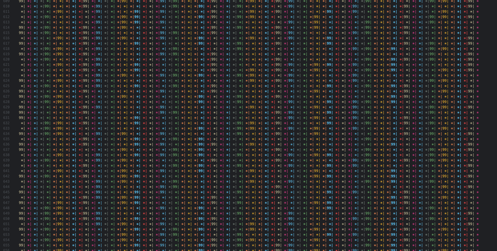
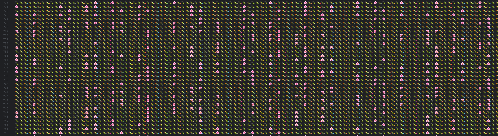

# Playing with Number Patterns

---

---

## About this project

---

It may be that some of what I have found is obvious to others, but for me these feel like new discoveries, and Im having so much fun trying to find connections, and more patterns myself (even if they have already been discovered :))

Recently I came across a book.. "Figuring the joy of numbers", and after reading the first couple of chapters on all the interesting ways to play with numbers, I got hooked at trying to find more. Eventually this lead me to prime numbers. One day I decided to just write them out on a piece of graph paper to see what kind of pattern (if any) they made.

I was suprised to find out a pattern emerged!
[Insert image here]

I have found other patterns, that are not related to Primes, which I will eventually add. But Primes so far have been fascinating.

Also if anyone comes across this, and has input, thats greatly appreciated. Suggestions on Libraries to view the data better as well :) I learned web development so any suggestions are also appreciated. For now, I have been throwing the data into CSV ot TXT files to look over, and I plan on creating functions to do the visual work I have been. A CSV with 400+ columns is hard to look at effectivly, and I plan to go much larger.

### Checklist

- [ ] Placeholder.
- [ ] Placeholder.
- [ ] Placeholder.
- [ ] Placeholder.
- [ ] Placeholder.
- [ ] Placeholder.
- [ ] Placeholder.
- [ ] Placeholder.
